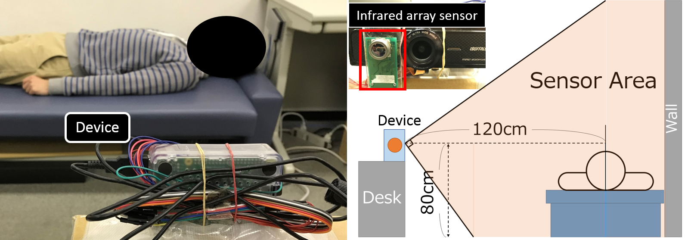
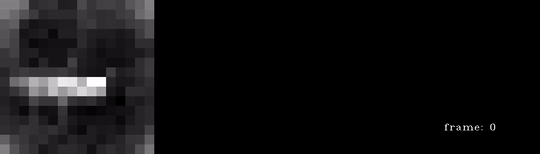

# IR_activity_recogniton
Activity recognition with Recurrent Convolutional Neural Network for nursing homes

I implemented this codes while referring to [Five video classification methods implemented in Keras and TensorFlow](https://blog.coast.ai/five-video-classification-methods-implemented-in-keras-and-tensorflow-99cad29cc0b5) and the [Github](https://github.com/harvitronix/five-video-classification-methods). 
I couldn't code this without his github. I sincerely appriciate to [Matt Harvey](https://blog.coast.ai/@harvitronix). 

## Activity recognition by 16x16 infrared array sensor temperature map with Recurrent Convolutional Neural Networks
The environment of collecting datasets is like below figure.  

 

And this data is collected from 7 young mans(22-23 ages). 
The infrared array sensor is 16x16 and captures 3 fps. 
"Data" folder has each temperaturemap csv and the normalized(0 to 255 integer) csv files.  
